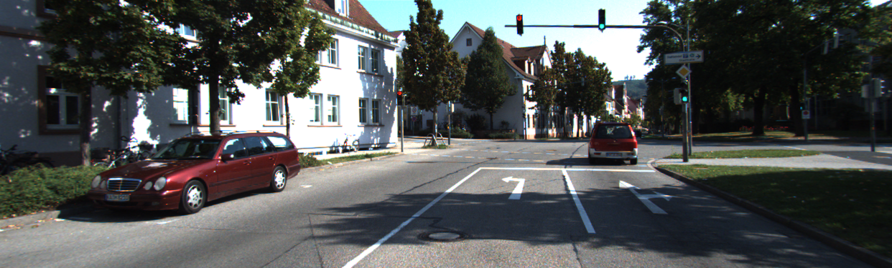

# AER1515H A3

This is the README for AER1515H: Perception for Robotics, assignment 3. 

## Description

This project covers depth estimation, 2D bbox object detection with YoloV3, and instance segmentation


## Getting Started

### Dependencies

* Describe any prerequisites, libraries, OS version, etc., needed before installing program.
* Prerequisites: 
* Python: 3.6.10
* opencv-python >= 4.4.0.44
* numpy >= 1.19.2  
* sklearn >= 0.0
* matplotlib >= 3.3.2

### Executing program

In part1_estimate_depth.py, there are 2 flags you can tune:
* TRAINING -> set this to True if you want to evaluate on training data, False if you want to evaluate on test data
* VIS -> for debugging, set this to True if you want to overlay depth estimation over left image; False otherwise

In part2_yolo.py, there is 1 flag you can tune:
* TRAINING -> set this to True if you want to evaluate on training data, False if you want to evaluate on test data

In part3_segmentation.py, there are 2 flags you can tune:
* TRAINING -> set this to True if you want to evaluate on training data, False if you want to evaluate on test data
* VIS -> for debugging, visualize estimated segmentation mask


* To run each part of the program: 
Part 1: 
```
python part1_estimate_depth.py
```

- The output of this file are estimated depth maps for each test image, located in:
```
data/test/est_depths
```

Part 2:
```
python part2_yolo.py
```

- The output of this file are labels from YoloV3 for each predicted object, for its associated test image, located in:
```
data/test/est_labels
```

Part3: 
```
python part3_segmentation.py
```

- The output of this file are segmentation masks for each test image, located in:
```
data/test/est_segmentation
```

```
Note: the estimated depths, labels, and segmentation masks for the test image set are also included in their folders at the same level as this ReadME, as well as in the data folder. 
```

## Authors

Contributors names and contact info

Lalit Lal
lalit.lal@mail.utoronto.ca
